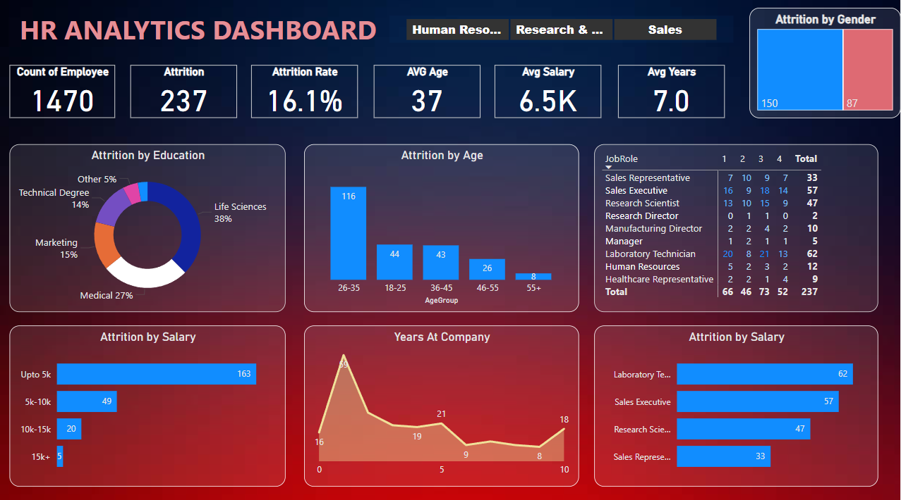

# HR Analytics Dashboard (Power BI)

This project is a Power BI dashboard analyzing HR data to uncover insights about employee attrition, demographics, and compensation.

## 📊 Key Features
- Visualizes attrition by age, gender, job role, salary, and education
- Displays key metrics: attrition rate (16.1%), average age, average salary
- Interactive filters and graphs for dynamic exploration

## 📁 Files Included
- `vishalpowerbi.pbix` – Power BI dashboard file
- `HR_Analytics.csv` – Sample dataset
- `vishalpowerbi.pdf` – Exported view of the dashboard

## 🔧 Tools Used
- Power BI Desktop
- CSV data manipulation
 
